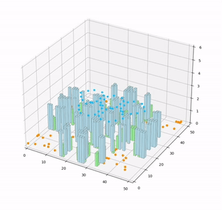
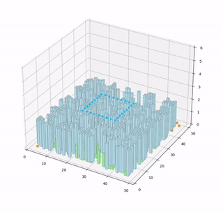

# UAVGym
UAVGym是一个用python编写的GYM风格的无人机仿真环境，用于强化学习算法的研究。
## 特征
- 支持自定义飞行环境，包括自定义地图大小、障碍物分布等
- 可以仿真控制不同数量的无人机
- 支持绘制无人机的三维飞行轨迹
- 集成OPenAI Gym接口，可与强化学习算法配合使用
## 演示
- Map1演示动画



- Map2演示动画


## 依赖
- python3.6+
- OpenAl Gym
- Matplotlib
- Numpy
## 使用方法
```
python myenv.py
```
更多详细用法请阅读代码注释
## 2023.10.6更新
在原有功能基础上，增加了BoidFlock的演示代码。
## 贡献
欢迎通过issue和PR为本项目做出贡献
